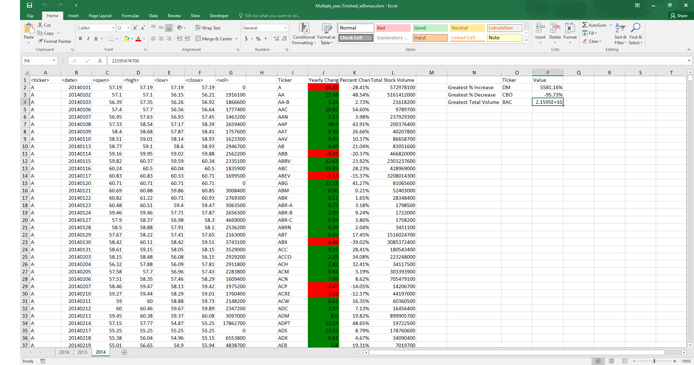
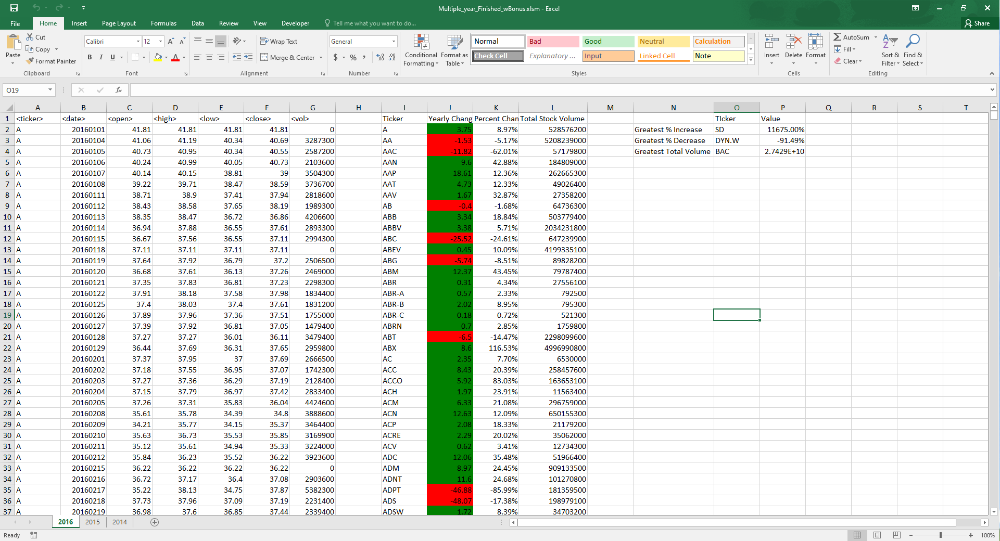
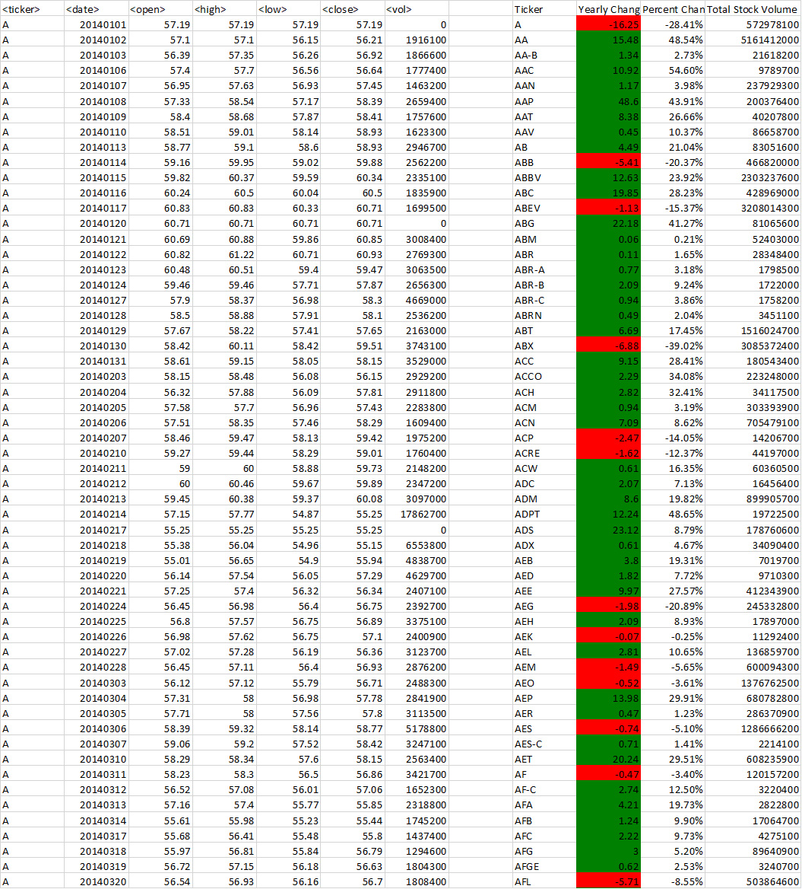
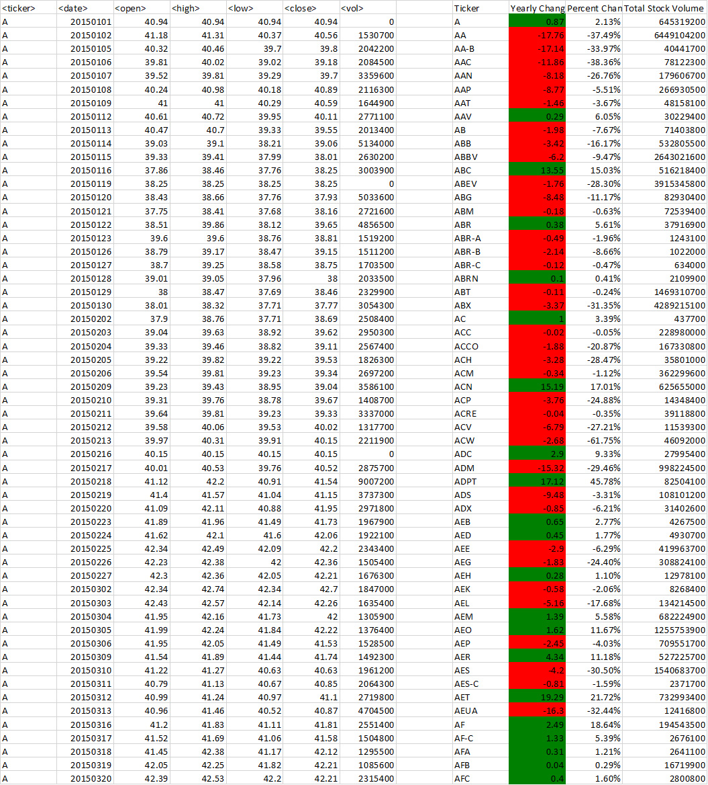
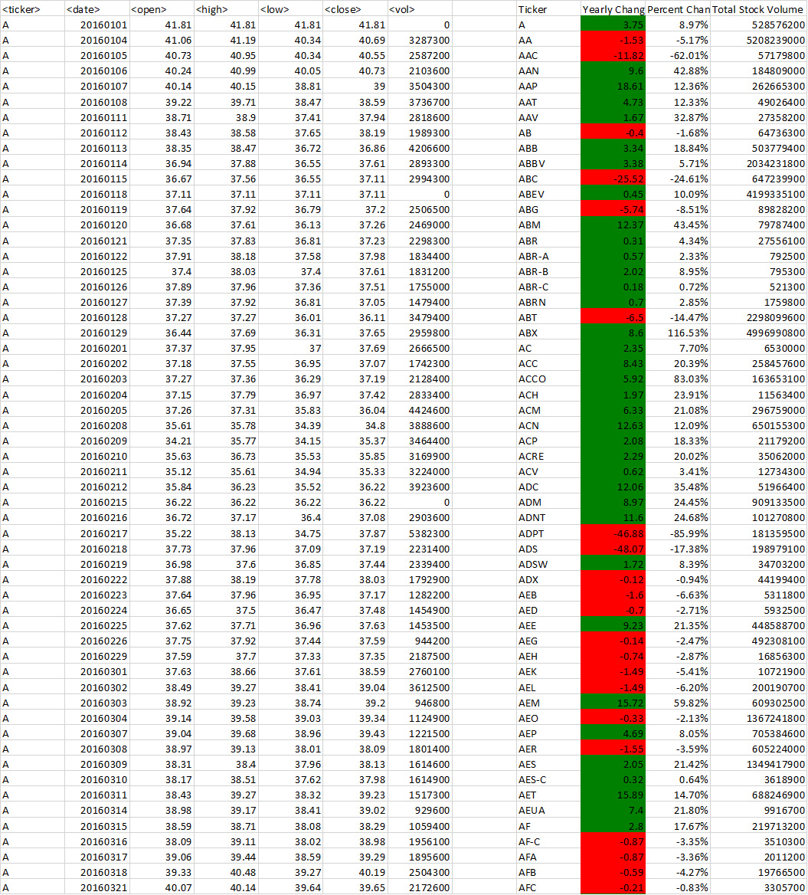

# VBA Homework - The VBA of Wall Street

# ScreenShots with results (red/green colors adjusted to represent holidays it was done duaring :)

# VBA Script that produced that results:
'
Sub LooppyLoop()
    Application.ScreenUpdating = False 'Speed up - stop flicker (no Screen refresh)
    tabCount = ActiveWorkbook.Worksheets.Count 'Getting number of tabs
    
    For i = 1 To tabCount   ' Begin the loop, running though differnt tabs
        Sheets(i).Select
        rowsCount = Cells(Rows.Count, 1).End(xlUp).Row 'Getting number of rows on current tab
        ticker = ""
        outputRow = 1
        Range("K:K").NumberFormat = "0.00%"
                
        For j = 2 To rowsCount  'Runing down original table
            If (Cells(j, 1) = ticker) Then  'Running with the same ticker
                Cells(outputRow, 9) = Cells(j, 1)
                runingTotal = runingTotal + Cells(j, 7)
                Cells(outputRow, 12) = runingTotal
                Cells(outputRow, 10) = Cells(j, 6) - newYear
                If (Cells(outputRow, 10) > 0) Then
                    Cells(outputRow, 10).Interior.ColorIndex = 10   'Green
                End If
                If (Cells(outputRow, 10) < 0) Then
                    Cells(outputRow, 10).Interior.ColorIndex = 3    'Red
                End If
                If (newYear <> 0) Then  'Trying not to devide by zero
                    Cells(outputRow, 11) = Cells(outputRow, 10) / newYear
                End If
                                
            Else    'New ticker found
                ticker = Cells(j, 1)
                outputRow = outputRow + 1
                runingTotal = Cells(j, 7)    'Pesky bug that was hiding for 5 hours
                newYear = Cells(j, 3)
            End If
            
            
        'Headers for generated table
        Range("I1") = "Ticker"
        Range("J1") = "Yearly Change"
        Range("K1") = "Percent Change"
        Range("L1") = "Total Stock Volume"
        Next j
        Range("L1").EntireColumn.AutoFit
        
        'Bonus table Headers
        Range("N2") = "Greatest % Increase"
        Range("N3") = "Greatest % Decrease"
        Range("N4") = "Greatest Total Volume"
        Range("O1") = "TIcker"
        Range("P1") = "Value"
        Range("N4").EntireColumn.AutoFit
        runingMax = 0
        runingMin = 0
        runingVolume = 0
        Range("P2").NumberFormat = "0.00%"
        Range("P3").NumberFormat = "0.00%"
        For j = 2 To outputRow  'Running down results table to generate Bonus table
            If (Cells(j, 11) > runingMax) Then
                runingMax = Cells(j, 11)
                Cells(2, 15) = Cells(j, 9)
                Cells(2, 16) = runingMax
            End If
            If (Cells(j, 11) < runingMin) Then
                runingMin = Cells(j, 11)
                Cells(3, 15) = Cells(j, 9)
                Cells(3, 16) = runingMin
            End If
            If (Cells(j, 12) > runingVolume) Then
                runingVolume = Cells(j, 12)
                Cells(4, 15) = Cells(j, 9)
                Cells(4, 16) = runingVolume
            End If
        Next j
    
    Next i  'Next tab
    
    Application.ScreenUpdating = True 'Return screen updates back on
End Sub
'

# ScreenShots with results (as long as excel will allow to save in one shot). If you need more - full results uploaded as .xlsm and .bas: 

